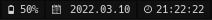

## i3blocks-modules.
i3blocks modules with interactive icons in Rust.

</img>

### Install
You will need to install rust and nerd-fonts.
```
git clone https://github.com/kali69bazdmeg/i3blocks-modules.git
cd i3blocks-modules
cargo -r
cp target/debug/<module> ~./config/i3/binaries/<module>
chmod +x ~./config/i3/binaries/<module>
```
