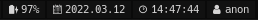

## i3blocks-modules.
i3blocks modules with interactive icons in Rust.

</img>

### Install
You will need to install rust and nerd-fonts.
```
git clone https://github.com/kali69bazdmeg/i3blocks-modules.git
cd i3blocks-modules
cargo -r
cp target/debug/<module> ~./config/i3/rust_binaries/<module>
chmod +x ~./config/i3/binaries/<module>
```

### Config example
```
[battery]
command=~/.config/i3/rust_binaries/battery
interval=1
color=#d5d4d4
background=#111111
border=#111111
border_right=6
border_left=6
markup=pango

[date]
command=~/.config/i3/rust_binaries/date
interval=1
color=#d5d4d4
background=#111111
border=#111111
border_right=6
border_left=6
markup=pango

[time]
command=~/.config/i3/rust_binaries/time
interval=1
color=#d5d4d4
background=#111111
border=#111111
border_right=6
border_left=6
markup=pango
```
